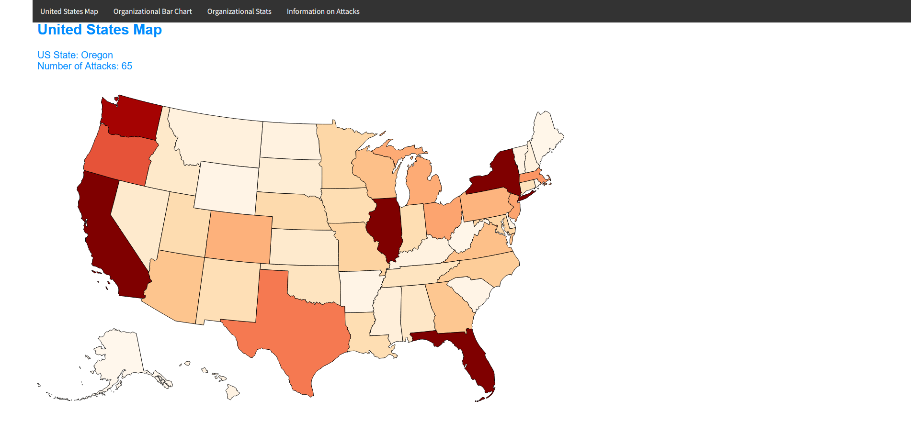

# Data_Visualization_Project

## Terrorism 

Post 9/11 Terrorism has become a hot topic in not only evidence for defense spending increases but also for explanatory evidence for international tourism and international cooperation. Within the United States there has been numerous attacks, the GTD the global terrorism database, has attempted to track these attacks. They've tried to label as well as quantify how to code a terrorist attack as well as taking time to highlight attacks which could be considered something else but based upon their labeling, they've qualified it as such. 

The GTD is an amazing source for terrorism centered information as well as terrorism datasets. But not many will take the time to read as well as inform themselves on the actuality that is terrorism. Specifically, the different groups and the frequency and body count these organizations have. The goal of this project is to focus on the United States and allow for an explorable United States map which identifies the number of attacks from 1970 - 2018. And identify the areas in which these terrorism organizations plan and attack these areas. Another goal of the project is to see the spread of attacks within each organization.

## [United States Terrorism from 1970 - 2018](https://scottbamfordj.github.io/Data_Visualization_Project/Project/)

The United States with its status as a first world country has attempted and tried to display itself as un affected or plagued by Terrorism, and instead try to describe its self as a combatant of Terrorism. Because of this when a terrorist attack happens, many are shocked and are bewildered that such a thing has happened within the warm and "safe" boundaries of the United States. This tool is seeking to help enlighten as well as answer questions regarding the regularity of United States Terrorism as well as the location and repercussions of said attacks.

## [Abstract for United State Terrorism for 1970 - 2018](https://scottbamfordj.github.io/Data_Visualization_Project/Deliverables/Abstract.html)

## [Reflection]()

